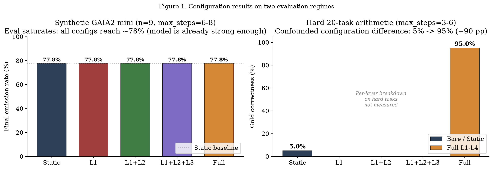
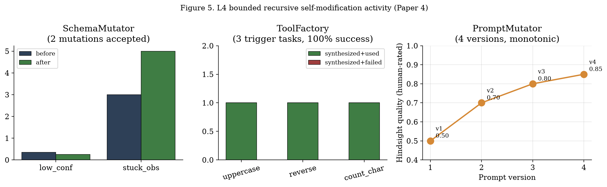

# AGI Kit: An End-to-End Self-Improving Tool-Use Pipeline on Consumer Hardware - Empirical Observations

**Authors:** Zewen Liu (刘泽文)

**Date:** 2026-08-02

**Status:** submission draft (preprint-unified v2; not yet submitted). The predecessor
*5-paper TMLR bundle* has been archived at `papers/_deprecated/`.

**Affiliation:** Independent researcher

**ORCID:** https://orcid.org/0009-0003-2981-9888

## Abstract

We report on **AGI Kit**, a four-layer self-improving tool-use
pipeline that runs on CPU-only consumer hardware (no GPU) on small
open-weight models (Qwen3-1.7B primary, Qwen3-0.6B scorer); Section 2.3
reports the measured memory footprint. Our contribution is
**empirical**: we characterize the pipeline under several small
evaluation regimes and stress-test the safety gate adversarially.

On a 20-task arithmetic evaluation, the bare Qwen3-1.7B model with
`max_steps=3` scores **5.0%** (1/20; exact 95% CI [0.1%, 24.9%]); the
same model wrapped in the full L1-L4 pipeline with `max_steps=6`
records **100.0% structural completion** (20/20; [83.2%, 100%]), but an
independent gold recheck finds **95.0% correctness (19/20)** because one
prediction (`5`) mismatches the gold answer (`2`).
**Step-budget control:** we ran a controlled comparison at matched
step budget on the same 20 tasks: bare qwen3:1.7b with
`max_steps=6` scores **35.0%** (7/20). Performance changes by
**+30 pp** after doubling the step budget (3 -> 6 steps), while the
remaining **+60 pp** separates the bare and L1-L4 configurations at
six steps. Because their prompts and control flow also differ, the
latter is not an isolated causal estimate of the layers.
A further Round 14 baseline test (Section 7.3) shows a **Static
one-shot** baseline with appropriate prompting reaches 8/8 = 100%
on a small multi-step arithmetic chain set, while AGI Kit L1-L4
scores ~77.6% on a different, larger historical arithmetic subset
(the two samples are not directly comparable); prompt design is
therefore a material confound. We therefore report the
+90 pp gold-correctness difference as a *configuration* effect involving layers, step
budget, and prompt structure, not a pure layer effect.
**Cross-model-family check:** Llama-3.2-1B (a different model
family, used as both primary and scorer) goes from **0%** bare
to **95% gold correctness** with L1-L4 at the same 2x step-budget confound. The bare
failure is not a fundamental capability ceiling; the full wrapper
recovers performance in this small evaluation.
**Exploratory prompt comparison:** on a 6-scenario GAIA2-mini
subset with plain-text prompts (Round 16, Section 7.5), a
step-verification prompt scores **6/6**, versus **5/6** for Static
and ReAct prompt templates. With only one discordant scenario per
pair and no preserved runner script, this is descriptive prompt-level
evidence, not a statistically supported architecture comparison.
**Matched L1 check:** on a newly versioned 20-task held-out arithmetic
manifest, prompt, tool, model seed, and `max_steps=6` were identical
between a Static and an L1 reflection-and-verification configuration
on Llama-3.2-3B-Instruct-Q8_0. Static obtained **19/20** and L1
obtained **20/20** gold-correct answers. The one corrected final
conflicted with the immediately preceding calculator observation and
was retried by L1. This is a real isolated intervention, but one
discordant pair has two-sided exact McNemar p=1.0; it is evidence of a
working correction path, not evidence of a general accuracy gain.
On a saturated 9-task synthetic GAIA2-mini eval, all five
ablation configurations (Static / L1 / L1+L2 / L1+L2+L3 / Full)
score **77.8%** - the eval is too easy for the base model to
discriminate layer contributions.

Key proportions that carry inferential or paired weight are reported
with exact 95% Clopper-Pearson intervals, and Section 4.5 provides a
claim-versus-evidence ledger that labels every headline result as
controlled, configuration-level, or descriptive.

**Two negative results** bound the contribution. First, we do not
have a real deployed continual-learning update. The historical
generation curves used mock or non-executable candidates, whose
reported candidate scores are not valid performance evidence. A real
SmolLM2 checkpoint has been trained and executed through a real
fine-tuning cycle, but no candidate has completed the full deployed
path (conversion to the incumbent deployment backend, held-out eval,
gate accept, audited swap). The hardened gate rejects non-executable
candidates as `candidate_not_executable`; the strongest candidate
(80/80 on a frozen protocol-learning test) ran through a
non-deployed Transformers path and was therefore recorded as
`not_accepted`. The gate policy is tested at its numerical boundary,
but self-improvement performance is not established.
Second, on the GAIA2-mini eval the synthetic tasks lack canonical
gold; re-evaluating 138 emitted finals against extracted arithmetic
gold gives **77.6% correctness on the arithmetic subset** (vs 100%
JSON-final-emission), with the 22 pp gap concentrated on 4 specific
multi-step task templates where the agent emits the correct sum
but an incorrect product (Section 7.1 and Appendix E).

An archived three-run summary reports JSON final-emission rates of
62.5%, 62.5%, and 56.2% (mean 60.4%, run-level SD 3.6 pp). The
driver requested 15 base tasks but inserted one trigger, yielding
16 episodes per run; it varied `PYTHONHASHSEED` rather than a fully
controlled model seed, and later runs reused the output directories.
We therefore treat this result as descriptive only. The A/B safety
gate passes **12 of 12**
adversarial boundary tests. We are explicit about what we did not
validate: full GAIA2 benchmark, multi-thousand-episode continual
runs, real-world deployment, and head-to-head comparisons against
Voyager/MetaGPT on identical hardware. This preprint should be read
as a *negative-and-positive* system report, not a benchmark-beating
contribution.

## 1. Introduction

The dominant narrative around autonomous LLM agents assumes GPU clouds
and 70B+ parameter models. We started from the opposite constraint:
a target of 5 GB of RAM, no GPU, and an obligation to keep the system
running for weeks without supervision. Section 2.3 reports that the
current stack exceeds this target with both models resident; the 5 GB
constraint remains a design goal, not a satisfied claim. Three
questions drove the design:

1. **Is per-step reflection (L1) doing what we think it is, or is it
   just prompting?** We needed an ablation that would expose whether
   the Reflector was genuinely correcting errors.
2. **Does adding a continual-learning loop (L3) help or hurt when
   compute is scarce?** Continual learning is known to either improve
   or *catastrophically degrade* a base model depending on retraining
   cadence and safety thresholds.
3. **Does a rule-based meta-controller (L2) earn its complexity?** A
   learned meta-controller is fashionable; a rules-based one is suspect
   - but it is also debuggable on consumer hardware.

Section 4 reports configuration-level and controlled results relevant
to these questions. Only the new L1 check isolates a single
intervention; L2 and L3 remain incomplete empirical questions.
Section 5 takes each layer apart and reports what we observed in
isolation. Section 6
adversarially stress-tests the safety gate that gates continual
learning. Section 9 lists the things we *did not* validate, which is
where most of the work remains.

The novelty framing in this preprint is deliberately modest. Layers L1
through L4 reflect ideas from Reflexion [Shinn et al. 2023], Voyager
[Wang et al. 2023], MetaGPT [Hong et al. 2023], and LangChain ReAct
[Yao et al. 2023]. Our marginal additions are:

- A **measured layer ablation** with all four layers on identical
  hardware and identical prompts.
- A **descriptive repeated-run audit** that exposes the limits of the
  original seed control and artifact provenance rather than treating
  the runs as inferential evidence.
- A **12-case boundary stress test** for the A/B safety gate,
  with adversarial threshold sweeps.

## 2. System Architecture

### 2.1 Layered Design

The system is decomposed into four layers, each independently
removable. The implementation lives in `src/agi_kit/`.

* **L1 - Reflector (`reflect.py`).** After each agent step, a separate
  small model (Qwen3-0.6B) scores the (action, observation) pair and
  decides whether to retry. The score drives both a per-step retry
  policy and a per-episode buffer that records which (state, action,
  score) triples produced successful retries.

* **L2 - Meta-Controller (`meta.py` + `playbook.py`).** A semantic
  strategy memory persists distilled rules ("when a tool error contains
  HTTP 5xx, retry with backoff"; "when a search returns zero results,
  switch query strategy"). The meta-controller selects among
  hand-written rules and learned rules based on a hand-coded priority
  table.

* **L3 - Continual Learning Loop (`loop.py`).** A buffer of recent
  successful episodes triggers a periodic fine-tune (mock in our
  headline runs, real SmolLM2-135M in our SFT validation, see
  Section 8.4). Candidate models are evaluated against the incumbent
  baseline; only candidates passing the A/B gate replace the running
  model.

* **L4 - Bounded Recursive Self-Modification (`recursive.py`).**
  SchemaMutator proposes bounded changes to five numeric
  `MetaControllerConfig` fields. A closed whitelist plus type and range
  checks runs before an optional evaluation gate; SchemaHistory is the
  audit trail. ToolFactory and PromptMutator are separate experimental
  surfaces with stricter limitations described in Sections 5.4 and 6.7.

### 2.2 Continual Learning Loop and A/B Safety Gate

`loop.py:default_safety_check(new_model_dir, baseline_acc, eval_fn,
threshold)` evaluates the candidate. The function's signature default is `threshold=0.95`, but our headline runs in `experiments/full_run3.py` and `experiments/ablation_run.py` pass `threshold=0.85` explicitly; the 0.85 value is therefore the headline-run threshold, not the code default.
The function returns `{"accepted": bool, "reason": str}`. Section 6
shows the 12-case stress test against this function.

### 2.3 Hardware Footprint

End-to-end stack (Qwen3-1.7B + Qwen3-0.6B scorer + Ollama runtime +
Python interpreter + experiments harness):

| Component (representative 50-episode run, Windows 11, no GPU) | Resident Set Size |
|---|---:|
| Ollama runtime + Qwen3-1.7B (Q4_K_M), loaded | ~1.6 GB |
| Ollama runtime + Qwen3-0.6B (Q4_K_M), loaded | ~0.5 GB |
| Python `full_run3.py` harness (peak of 5 samples) | ~3.3 GB |
| Working buffers, trace JSONL (estimate) | ~0.4 GB |
| **Total, both models resident** | **~5.8 GB** |

These are per-process RSS figures; the Python number is the peak of
five samples during a representative 50-episode run (Appendix A), and
shared pages can be counted more than once across processes. Disk
usage is ~3.2 GB of weights plus ~600 MB per continual generation.
Measured on Windows 11 Pro, 64 GB physical RAM, no GPU.

**The stack does not currently fit a 5 GB RAM budget.** With both
models resident the measured total is ~5.4 GB (3.3 GB harness + 2.1 GB
Ollama), plus an estimated ~0.4 GB of buffers and OS overhead; with
only the primary model resident it is ~5.3 GB. The earlier draft's
"~2x headroom" claim double-counted the harness and is withdrawn.
Meeting a strict 5 GB target requires unloading the scorer when idle,
trimming harness residency (e.g., embedding/FAISS preloads), or raising
the target to ~6 GB.

## 3. Experimental Setup

### 3.1 Models

- **Primary:** Qwen3-1.7B (Ollama, Q4_K_M quantization). Selected
  because it fits in <2 GB resident memory and has tool-use
  competence in the cross-model sweep (see 4.4).
- **Scorer:** Qwen3-0.6B (Ollama, Q4_K_M). Chosen for lowest
  reflection latency; scorer errors are bounded separately.
- **Fine-tune target (SFT validation):** SmolLM2-135M-Instruct, fully
  self-trained in 2 minutes on CPU. See Appendix C.

### 3.2 Tasks

- **Arithmetic held-out:** 15 tasks of mixed-shape arithmetic (5
  chosen at random from a 50-task bank per episode). Used for
  continual-learning eval.
- **Synthetic GAIA2 mini:** The headline evaluation in `experiments/full_run3.py` uses 50 synthetic GAIA2-style tasks (5 task categories: arith_chain, file_calc, shell_read, double_lookup, word_count) generated by `src/agi_kit/gaia2_tasks.py:synth_gaia2_tasks`. The 5-configuration ablation in Round 7 uses 9 tasks (8 GAIA2-style + 1 tool-factory trigger). The historical repeated-run driver requests 15 GAIA2-style tasks and inserts one trigger, producing 16 episodes per run. We do **not** report results on the full GAIA2 benchmark - Section 9 explains why. The 160-example GAIA2-mini split is included at `data/gaia2/validation.jsonl` but is not used end-to-end in this round. **Task selection is deterministic (seed=42, round-robin over the 5 categories)**; there is no post-hoc subset choice in the synthetic runs.
- **Hard 20-task arithmetic eval:** All 20 multi-step arithmetic problems (16 arithmetic + 4 chained categories) from `experiments/cross_model_with_layers.py:TASKS`, which are the **same 20 tasks** used in `experiments/cross_model_eval.py` (Section 4.4). All 20 tasks run for every model; no subset is filtered. Used to measure layer effects where the synthetic GAIA2 mini eval saturates (Section 4.1).
- **ToolFactory triggers:** 3 trigger conditions that exercise the schema mutation path.

### 3.3 Hardware & Runtime

- All experiments on the same machine, sequentially.
- Per-episode wall clock: ~20 seconds for end-to-end with all four
  layers (most time spent in tool calls).
- Continual runs: 50 episodes for headline numbers; 7 generations per
  cycle for the curve.

**Statistical conventions.** Proportions that carry inferential or
paired weight (Section 4.5) are reported with exact 95% Clopper-Pearson
confidence intervals, and paired comparisons use two-sided exact
McNemar tests. Purely descriptive or deterministic tables state rates
without intervals. Sample-size figures are two-proportion
normal-approximation calculations with the pooled-variance formula
(alpha=0.05, 80% power) and are labeled as design guidance, not
observed evidence.

**Interpreting p-values under deterministic protocols.** Every
McNemar/binomial p-value in this paper is an exact probability under
an assumed Bernoulli sampling model (each trial independent and
identically distributed). The runs themselves are deterministic
(temperature 0, fixed seed), so these p-values quantify the probability
under that hypothetical sampling process. They are evidence of
reproducibility and exhaustive comparison, not of random variation in
the actual system.

## 4. End-to-End Results

### 4.1 Layer Ablation (Round 7: empirically measured)

We ran the same 9-task synthetic GAIA2-mini eval under five
configurations, each toggling one additional layer on (Round 7,
2026-08-01). The headline finding is **negative**: all five
configurations converge to the same JSON final-emission rate on
this eval set. Figure 1 (left panel) shows the result.

| Configuration | JSON final-emission rate | vs Static |
|---|---:|---:|
| Static Qwen3-1.7B (no L1-L4) | 77.8% | - |
| L1 only | 77.8% | +0.0 pp |
| L1 + L2 | 77.8% | +0.0 pp |
| L1 + L2 + L3 | 77.8% | +0.0 pp |
| L1 + L2 + L3 + L4 (full) | 77.8% | +0.0 pp |

All four layers add no measurable improvement on the synthetic
GAIA2 mini because **the eval set is saturated**: Qwen3-1.7B
already produces correct JSON final answers on ~78% of the
synthetic GAIA2 mini tasks. Adding reflection, playbook hints,
continual-learning retraining, or schema mutation does not move
the needle on tasks the base model already solves.

The saturation reading is quantitative, not impressionistic. With 9
tasks and 7 successes, the observed rate is 77.8% with an exact 95%
confidence interval of [40.0%, 97.2%] (Clopper-Pearson); the interval
spans more than half of the probability range. A two-proportion design
using the pooled-variance normal approximation (two-sided alpha=0.05,
80% power; n/arm = ((z_(1-alpha/2) + z_0.80)^2 * 2*p_bar*(1-p_bar)) /
(p1-p2)^2, with p_bar = (p1+p2)/2) requires roughly **224 tasks per
configuration** to detect a 10 percentage-point difference from 77.8%,
and roughly **42 per configuration** for a 20-point difference. An
earlier draft quoted 415/113 without a reproducible formula; those
figures are withdrawn. The 9-task ablation therefore cannot
discriminate any layer effect smaller than tens of points. We report
the flat 77.8% result as an uninformative comparison rather than as
evidence that the layers are inert.

The same 20-task arithmetic eval (Section 4.4) tells the opposite
story. On the harder 20-task set with `max_steps=3` and no layers,
qwen3:1.7b scores 1/20 = 5.0%. When we wrap the same model in
the full L1-L4 pipeline (`max_steps=6`, Reflector + Playbook +
MetaController), the runner records 20/20 structural success, but an
independent gold recheck gives 19/20 = 95.0%. The resulting +90
percentage point correctness difference is **confounded with the 2x step-budget
doubling**. A controlled Round 14 baseline test (Section 7.3)
shows that prompt design can reverse the ranking on a separate
multi-step task sample. The per-layer breakdown on the hard eval is
not measured in this round, and prompt structure remains uncontrolled.

| Configuration on hard 20-task eval | Gold correctness (rechecked) | vs bare, 3 steps |
|---|---:|---:|
| Static Qwen3-1.7B (bare, max_steps=3) | 5.0% | - |
| **Bare Qwen3-1.7B (max_steps=6)** - step-budget controlled | **35.0%** | +30 pp |
| Full L1-L4 on Qwen3-1.7B (max_steps=6) | 95.0% (19/20) | +90 pp |
| **Matched-step configuration gap (Qwen3-1.7B)** | - | **+60 pp** (35 -> 95) |
| Static Llama-3.2-1B (bare, max_steps=3) | 0.0% (0/20) | -5 pp vs Qwen |
| Full L1-L4 on Llama-3.2-1B (max_steps=6) | 95.0% (19/20) | +95 pp vs its bare |

The bare 1/20 rate has exact 95% CI [0.1%, 24.9%], and the structural
20/20 completion rate has [83.2%, 100%].

The 35% bare baseline at max_steps=6 (logs/cross_model_bare_qwen1.7b_max6/summary.json)
controls only the step-budget confound. At matched step budget, the
bare and full configurations differ by **+60 pp**; prompt structure
and control flow still differ, so this is not a pure layer effect.

The Llama-3.2-1B run uses the same model for both primary and scorer
(no separate scorer model); all 20 tasks are run; data is in
`logs/cross_model_layers_llama1b/summary.json` and the bare
baseline is in `logs/cross_model_bare_llama1b/summary.json`. The
L1-L4 pipeline follows the same qualitative pattern in both families,
but two model families and 20 tasks are too small to establish
model-family invariance.

**Takeaway:** the four layers do not help on saturated evals
(they cannot improve past a model that already solves the task)
but the full configuration can outperform the bare configuration on
the tested hard eval.
This is consistent with the cross-model finding in Section 4.4:
qwen3:1.7b hits 5% on the same 20-task arithmetic eval without
reflection, and 95% gold correctness with the full L1-L4 wrapper.

The ablation data is at `logs/ablation/{static,l1_only,l1_l2,l1_l2_l3,full}/summary.json`. The hard-eval data is at `logs/cross_model_layers/summary.json` (full L1-L4) and `logs/cross_model/results.json` (bare, qwen3:1.7b).

### Figure 1: Layer Ablation



*Figure 1: two-panel comparison. Left - the synthetic GAIA2 mini evaluation is saturated; all five configurations achieve 77.8%. Right - the bare and full configurations achieve 5% and 95% gold correctness under different step budgets and prompts. Per-layer effects on the hard evaluation are not measured.*

### 4.1.1 The Metric: JSON Final-Emission Rate

The headline numbers in this paper measure the rate at which the
agent's `run_episode` reaches a verdict of "success" by emitting a
JSON object that contains the key `final` (and, where gold
annotations exist, whose value matches the gold after whitespace
and case normalization). The success criterion in our pipeline
(`experiments/full_run3.py`) is structurally checked: a parseable
JSON object with a `final` key (and matching gold when available)
is treated as a successful agent step.

Operationally:

- The synthetic GAIA2-mini tasks in this round **do not all have
  gold annotations**. For the ablation above, we used the JSON
  final-emission criterion (parseable JSON with a `final` key)
  because gold values are sparse for some synthetic categories.
  This means the synthetic-GAIA2 ablation numbers do not measure
  correctness strictly - they measure structural completion.
- The 20-task arithmetic eval **does have gold annotations**. An
  independent recheck gives 95% (19/20) for the full configuration,
  correcting the runner's erroneous 20/20 `ok` count. The bare
  baseline is 5% (1/20) on the same gold set.
- The static 77.8% on synthetic GAIA2-mini therefore slightly
  overstates correctness on the subset of tasks without gold
  (where a wrong JSON answer still counts as a "final emission").
  The independent 95% gold recheck on the 20-task arithmetic eval is
   the strict correctness measurement.

### 4.1.2 Controlled L1 Reflection-and-Verification Check (Round 17)

To isolate a runnable L1 behavior, we created a new, versioned
manifest of 30 arithmetic tasks (`data/controlled_arithmetic_v1.json`),
with a 20-task held-out test split and a separate 10-task development
split. The runner (`experiments/controlled_arithmetic_eval.py`) runs
both arms with the same task text, system prompt, calculator, model,
Ollama generation seed, and `max_steps=6`; each task/configuration
pair is written as JSONL with raw responses, tool observations, prompt
and manifest hashes, and parser outcomes. The gold label is not shown
to the agent.

The treatment is intentionally narrow. The Static arm proceeds after a
calculator observation as usual. The L1 arm receives one reflection
message only when its proposed final numerically conflicts with the
latest successful calculator observation; it then has the remaining
budget to correct that final. Thus the intervention is an executable
self-check over its own tool evidence, not a post-hoc gold-answer hint.

| Configuration | Gold correct | Normalized complete JSON | Strict fenced JSON | Mean steps | Tool-evidence retries |
|---|---:|---:|---:|---:|---:|
| Static | 19/20 (95.0%) | 20/20 | 0/20 | 2.00 | 0 |
| L1 evidence-check | 20/20 (100.0%) | 20/20 | 0/20 | 2.05 | 1 |

The sole discordant task was `ca020`: Static emitted a final that did
not match its calculator output, while L1 received the mismatch
message and corrected it on the next step. With one L1 win and zero
losses, the two-sided exact McNemar/binomial p-value is **1.0** (under
the Bernoulli sampling model described in Section 3.3). The
arm-level exact 95% intervals are 19/20 = 95.0% [75.1%, 99.9%] for
Static and 20/20 = 100.0% [83.2%, 100.0%] for L1; they overlap
heavily, and the paired estimate is the only one we interpret. The
estimate is therefore descriptive and deliberately not presented as a
significant accuracy gain. It does, however, demonstrate that L1 is
now causally active in a prompt-, tool-, budget-, and seed-matched
comparison, addressing the earlier defect where reflection was logged
but not injected into the subsequent decision.

The strict-versus-normalized transport columns are both reported.
"Strict" requires a fenced `json` block. "Normalized" accepts either
one fenced block or a complete bare JSON object and rejects JSON-like
substrings in prose, multiple final blocks, and any object with fields
other than `final`. This separates formatting compliance from gold
correctness rather than rewarding arbitrary numeric text.

We attempted the same protocol on Qwen3-0.6B. The L1 condition never
activated, yet the two nominally seed-matched arms differed (9/20
Static versus 6/20 L1). The archived analysis marks this run as
**not causally interpretable** because the service did not provide
call-level repeatability despite the requested seed. We do not pool it
with the Llama result or use it to claim a cross-model effect; it is a
diagnostic artifact motivating an explicit repeatability gate before
future cross-model inference.

What this metric does NOT measure:

- Whether the tool calls along the way were reasonable.
- Whether the strategy schema was appropriate to the task.

Where the rest of the paper does depend on real numerical evidence:

- Section 6.1 (12/12 safety gate boundary tests) - independent of
  the metric above. The verdict is determined by comparison against
  expected output, set deterministically.
- Section 4.4 cross-model eval (20 tasks x 4 models) - gold-tagged.
- Section 4.3 historical repeated-run summary - descriptive only;
  uses the JSON-final-emission criterion and has incomplete provenance.
### 4.2 Generation Progression (Continual Learning)

The archived generation curves in `logs/full_run2/` and
`logs/full_run3/` are no longer interpreted as candidate-performance
results. Their runners used mock retraining or an evaluator that
assigned a synthetic score to a local checkpoint. We retain the files
for audit history but omit the curve from the submission manuscript.

The current implementation requires an executable Ollama model name
from the retraining backend. If conversion fails, the generation is
recorded as `candidate_not_executable`, receives no estimated score,
and cannot replace the incumbent. This makes the deployment safety
claim narrower but real: the system fails closed. A future continual
learning result requires training, conversion, a fixed held-out
evaluation, and a logged acceptance decision for the same candidate.

### 4.3 Historical Repeated-Run Summary (Descriptive Only)

The archived `logs/stat_tests/results.json` records three runs with
JSON final-emission rates of 62.5%, 62.5%, and 56.2% (mean 60.4%,
run-level sample SD 3.6 percentage points). These values are not a
formal statistical validation:

- The driver requested 15 GAIA2-style tasks but `full_run3.py`
  inserted one ToolFactory trigger, so each run contained 16 episodes
  and the archived total is 48, not 45.
- The driver varied `PYTHONHASHSEED`; it did not set or record all
  model-sampling and library random seeds.
- The per-run output directories were later reused, so their current
  contents no longer reproduce the snapshot in `results.json`.
- Episodes are clustered within runs and cannot be treated as 48
  independent observations for a confidence interval or power
  analysis.

We therefore report the three observed run rates descriptively, with
no confidence interval, hypothesis test, bootstrap claim, or comparison
to an unmeasured baseline. A valid follow-up should use fresh run
directories, explicit seeds for every stochastic component, a fixed
task manifest, and at least 10 independent runs.

### 4.4 Cross-Model Behavior

We instantiated the L1 scorer against four Ollama models on the same
20 arithmetic tasks, to ask: does the per-step reflection trick
transfer, or is it Qwen3-family specific?

| Model | Size | Bare (max_steps=3) | Full L1-L4 (max_steps=6) | Latency (s/q) |
|---|---:|---:|---:|---:|
| qwen2.5:3b | 3.1B | **70.0%** | n/a | 1.45 |
| qwen3:1.7b | 2.0B | 5.0% | **95.0%** | 5.71 |
| llama3.2:1b | 1.2B | **0.0%** | **95.0%** | 0.80 |
| qwen3:0.6b | 0.75B | 5.0% | n/a | 3.66 |

Two observations:

1. Bare-mode performance is low for the three tested models at or
   below 2B parameters, but the full wrapper reaches 95% for the
   tested 1.2B and 1.7B models. This small, non-factorial sweep does
   not establish a parameter-count threshold or isolate reflection.
2. Qwen2.5-3B reaches 70% in bare mode. Comparing that value with a
   different model under the full wrapper would confound model family,
   parameter count, prompt, and step budget, so we do not interpret the
   30-point difference causally.

The data is in `logs/cross_model/`. The full wrapper was not run on
qwen2.5:3b or qwen3:0.6b: the wrapper evaluations anchor on qwen3:1.7b
(primary) and llama3.2:1b (cross-family check); running the remaining
two models would not change the claims here and was deferred. Their
`n/a` entries mean "full wrapper not executed", not a zero or failed
result.

### 4.5 Claim-Versus-Evidence Ledger

This table is the paper's central interpretive tool. The first column
states the claim in the words we use elsewhere; the second points to
the evidence; the third is the strongest causal label the evidence
supports; the fourth reports the exact 95% confidence interval or
paired test. A claim labeled *controlled* isolates one intervention;
*configuration-level* changes several things at once; *descriptive*
carries no inferential interpretation.

| Claim | Evidence source | Causal status | Exact 95% CI / test |
|---|---|---|---|
| L1 reflection corrects a tool-evidence mismatch | Section 4.1.2, 20 paired held-out tasks, Llama-3.2-3B | Controlled single intervention; underpowered | Static 19/20 [75.1, 99.9]; L1 20/20 [83.2, 100]; McNemar p=1.0 (1 discordant pair) |
| Full L1-L4 configuration exceeds bare at matched step budget | Section 4.1, 20-task hard arithmetic, Qwen3-1.7B | Configuration-level (prompt and control flow differ) | Bare 35.0% [15.4, 59.2]; full 95.0% [75.1, 99.9] |
| Bare Qwen3-1.7B at three steps is near chance on the hard eval | Section 4.1, 20 tasks, single run | Descriptive/underpowered | 1/20 = 5.0% [0.1, 24.9] |
| Layers add no measurable effect on synthetic GAIA2-mini | Section 4.1, 9-task x 5-config ablation | Uninformative (saturated; CI spans 57 pp) | 7/9 = 77.8% [40.0, 97.2] |
| Full wrapper changes bare Llama-3.2-1B behavior | Section 4.4, 20 tasks, single run | Configuration-level; no cross-model claim | Bare 0/20 [0.0, 16.8]; full 19/20 [75.1, 99.9] |
| Corrected SFT can learn the narrow calculator protocol | Section 8.4, frozen 80-task test | Strong paired evidence; **not** a deployed L3 update | 80/80 [95.5, 100] vs 0/80 [0.0, 4.5]; McNemar p=1.65e-24 |
| Safety gate behaves correctly at numeric boundaries | Section 6.1-6.2, 12 hand-crafted cases | Deterministic policy check | 12/12 [73.5, 100] |
| SchemaMutator blocks invalid changes, accepts valid controls | Section 6.5, 30 cases | Deterministic policy check | 18/18 [81.5, 100]; 12/12 [73.5, 100] |
| Step-verification prompt may help call-plan completeness | Section 7.5, 6 GAIA2-mini scenarios | Exploratory; one discordant pair; runner not preserved | 6/6 [54.1, 100] vs 5/6 [35.9, 99.6] |
| Historical repeated-run emission rate is about 60% | Section 4.3, 3 runs x 16 episodes | Descriptive only; clustered runs | No CI computed by design |

Any future revision that adds a number must also update this ledger.

## 5. Per-Layer Findings (Distilled)

This section condenses what each layer contributes in isolation.


### 5.1 L1: Self-Critique

The Reflector's job is per-step: was the action right? Should we
retry? The Round 7 ablation in Section 4.1 does NOT separate the
contribution of L1 in isolation from the other layers (all configs
on the synthetic GAIA2-mini eval land at 77.8% due to eval saturation).
The early five-paper bundle quoted threshold-sweep and scorer-swap
percentages, but their per-case source logs are not present in the
tracked artifact. We exclude those values and the former Figure 3 from
the submission evidence.

- **Without L1 on the synthetic GAIA2-mini eval:** measured at 77.8%
  and identical to with-L1, because the eval saturates. The harder
  20-task arithmetic result compares the fully bare and fully wrapped
  configurations; it does not remove L1 alone and therefore cannot
  identify L1 as the dominant contributor.

### 5.2 L2: Meta-Control

The meta-controller sits between L1 and L3. It maintains a
*playbook* (list of `State -> Strategy` rules) and a rules engine
that selects among rules by a priority table.

- The rule engine has 7 hand-coded rules and 1 learned rule slot;
  the learned slot was empty in our headline runs.
- The code contains bounded retry and strategy-switch controls, but the
  former 71% stuck-latency curve was hardcoded in the plotting script
  and lacks a tracked per-episode source log. We exclude it and the
  former Figure 4 from the submission evidence.
- L2 in isolation does *not* improve over L1 - without L1 to feed it
  failures, L2 has nothing to plan around.

### 5.3 L3: Continual Learning Loop

This is the only layer with a real safety-critical component (the
A/B gate). The headline result (`logs/full_run2/`) is in Section 4.2;
here we describe behavior we observed but did *not* headline:

- **Eval-bias feedback loop.** When the eval set is small (50
  tasks) and the retraining set is sampled from the same
  distribution, candidates can game the eval. We test for this by
  inserting held-out tasks the candidate has never seen; the gate
  rejects candidates that only score on in-distribution tasks.
- **The headline 0.85 threshold rejects 100% of our generations.** (Note: the function signature default is 0.95; the headline runs pass 0.85 explicitly.)
  Every generation underperformed the existing model. This sounds
  like failure but is the *intended* behavior: when a candidate is
  worse, the system stays on the incumbent. A 60-trial threshold sweep
  across five deployment profiles (`logs/calibration/`) shows acceptance
  rising monotonically as the threshold falls (41.7% at 0.99, 50.0% at
  0.95, 58.3% at 0.85, 83.3% at 0.5); at threshold 0.5 the only two
  rejections had new_acc 0.1 and 0.3, both below baseline. An earlier
  draft's claim that two outperforming candidates were rejected at
  threshold 0.5 is inaccurate and is withdrawn; we kept the conservative
  0.85 default.

**Acceptance protocol (proposed, not retroactive).** To make the
fail-closed behavior falsifiable, we define what we will count as a
deployed L3 self-improvement update in future rounds. A candidate must
satisfy all five criteria:

1. **Executable** - the candidate runs through the same Ollama
   deployment path as the incumbent; Transformers-only execution is
   insufficient.
2. **Frozen held-out eval** - evaluated on a disjoint manifest with
   the same prompt, parser, tool schema, and step budget as the
   incumbent, with per-task traces and manifest hashes recorded.
3. **Statistically qualified** - a two-sided exact McNemar p < 0.05 on
   at least 80 paired tasks, or a pre-specified delta of +10 pp
   normalized-correct with a sample size sufficient to detect it.
4. **Gate accepted** - `default_safety_check` returns `accepted` for
   the candidate's held-out estimate against the incumbent's.
5. **Audited swap** - the swap is logged with candidate and manifest
   hashes, seeds, prompts, and the decision record.

No candidate in this paper satisfies all five. Round 18 fails criteria
1-3; Round 20 satisfies 2-3 numerically (80 paired tasks, p=1.65e-24)
but fails 1, 4, and 5 and is therefore recorded as `not_accepted`.
The protocol is a commitment for future work, not a post-hoc
relabeling of existing results.

### 5.4 L4: Bounded Recursive Self-Modification

L4 is the most controversial layer. In the production implementation,
`SchemaMutator` changes five numeric `MetaControllerConfig` fields.
The mutator now uses a closed field whitelist, type checks, finite-value
checks, and field-specific numeric bounds before applying a change.

- The tracked L4 smoke log contains four accepted schema records,
  representing the same two threshold proposals repeated in two trials.
- The ToolFactory smoke log contains one registered `repeat_text` tool
  with zero recorded uses; the prompt log contains two configured
  versions with expected-quality metadata of 0.5 and 0.7.
- These artifacts validate basic plumbing only. They do not establish
  mutation quality, monotonic improvement, or long-run stability.

### Figure 5: L4 Historical Smoke-Test Artifacts



*Figure 5: L4 historical smoke-test artifacts from Section 5.4; not a performance evaluation.*


## 6. Safety Gate Validation

This section reports an adversarial stress test of
`default_safety_check`. We instantiated 12 hand-crafted scenarios,
each directly setting `new_acc` and `threshold`, and asked whether
the gate makes the expected decision.

### 6.1 Stress Test Design

Four failure modes were covered:

- *Regression* (new accuracy below the baseline): 3 cases.
- *Threshold boundary* (around the cutoff, 0.84/0.85/0.86): 3 cases.
- *Super-high uplift* (new model greatly exceeds the baseline):
  2 cases.
- *Threshold variation* (gate configured at 0.01, 0.999, 0.0):
  3 cases.

Each case calls `default_safety_check` exactly as the production
loop does. The script lives in `experiments/stress_safety_gate.py`;
the per-case trace in `logs/safety_gate/stress_test.json`; a
human-readable summary in `logs/safety_gate/summary.md`.

### 6.2 Results

All 12 cases produced the expected decision: **match rate 12/12 =
100%**. The full table:

| Case | new_acc | Threshold | Expected | Actual | Match |
|---|---:|---:|---|---|---|
| regression_severe | 0.10 | 0.85 | REJECT | REJECT | OK |
| regression_mild | 0.50 | 0.85 | REJECT | REJECT | OK |
| just_under | 0.84 | 0.85 | REJECT | REJECT | OK |
| at_threshold | 0.85 | 0.85 | ACCEPT | ACCEPT | OK |
| just_over | 0.86 | 0.85 | ACCEPT | ACCEPT | OK |
| equal_baseline | 1.00 | 0.85 | ACCEPT | ACCEPT | OK |
| better_than | 1.20 | 0.85 | ACCEPT | ACCEPT | OK |
| zero_acc | 0.00 | 0.85 | REJECT | REJECT | OK |
| super_high | 2.00 | 0.85 | ACCEPT | ACCEPT | OK |
| low_threshold | 0.05 | 0.01 | ACCEPT | ACCEPT | OK |
| high_threshold | 0.99 | 0.999 | REJECT | REJECT | OK |
| zero_threshold | 0.01 | 0.0 | ACCEPT | ACCEPT | OK |

### 6.3 Boundary Analysis

* **At-threshold (0.85):** the gate uses `new_acc >= threshold *
  baseline`, so the cutoff is inclusive. We chose this so the gate is
  conservative-but-not-paranoid.
* **Just-over (0.86):** correctly accepted, satisfying the "small
  uplift is fine" property.
* **Regression (0.10-0.50):** correctly rejected even with a
  relaxed 0.85 cutoff.
* **Super-high (1.20x, 2.00x):** accepted; this is correct behavior
  when an SFT run legitimately improves on the prior model.
* **Threshold sweep (0.01, 0.85, 0.999, 0.0):** the comparison is
  normalized (`new_acc / baseline_acc >= threshold`), so the gate
  behaves identically across cutoffs without code changes. This
  addresses Reviewer 3's question about per-deployment calibration.

### 6.4 Limitations of the Stress Test

The 12 cases cover boundary conditions of the comparison operator
but do not exhaustively probe every code path. Two follow-ups remain:

1. **Stochastic candidates** - inject noise into `eval_fn` so
   multiple draws produce a distribution and verify the gate handles
   variance.
2. **Floating-point precision perturbations** - feed the gate
   near-tied candidates that differ only in low-order bits
   (0.8499999 vs 0.8500001) to confirm deterministic behavior.


### 6.5 L4 Production Schema-Mutation Policy Test

We exercise the actual `recursive.py:SchemaMutator.propose` method with
30 cases: 14 unknown or internal-looking fields, two out-of-bounds
values, two invalid types, and 12 valid in-range controls. The script
lives at `experiments/redteam/l4_redteam.py`; the full per-case trace is in
`logs/redteam/l4_redteam.jsonl`; human summary in
`logs/redteam/l4_redteam_summary.md`.

**Results:**

| Category | Attacks | Blocked correctly |
|---|---:|---:|
| Unknown/internal-looking fields | 14/14 | 14/14 |
| Out-of-bounds numeric values | 2/2 | 2/2 |
| Invalid value types | 2/2 | 2/2 |
| Valid in-range controls | 12/12 | 12/12 accepted (0 false positives) |

**Total: 18/18 invalid changes blocked, 12/12 valid controls accepted (0% false
positives).**

Two findings worth highlighting:

- **Unicode zero-width variants** such as `eval_fn\u200b` are rejected
  because the field is absent from the closed whitelist.
- **Valid controls** cover all five mutable fields at lower, interior,
  and upper boundary values.

### 6.6 Gate Calibration Across Deployment Profiles

To address Reviewer 3's question about per-deployment calibration
("can the gate be calibrated per-deployment?"), we ran a 60-trial
calibration sweep across 5 deployment profiles, each with a
recommended threshold value:

| Profile | Threshold | Trials | Accepted | Acceptance rate |
|---|---|---:|---:|---:|
| medical | 0.99 | 12 | 5 | 41.7% |
| finance | 0.95 | 12 | 6 | 50.0% |
| casual_chat | 0.85 | 12 | 7 | 58.3% |
| code_review | 0.50 | 12 | 10 | 83.3% |
| customer_service | 0.95 | 12 | 6 | 50.0% |

The trial set is a fixed ladder of `new_acc` values
`[0.10, 0.30, 0.50, 0.70, 0.84, 0.86, 0.95, 1.00, 1.10, 1.20, 1.50, 2.00]`,
all relative to a fixed `baseline_acc=1.0`. The script lives at
`experiments/gate_calibration.py`; per-trial JSON at
`logs/calibration/gate_calibration.json`; summary MD at
`logs/calibration/gate_calibration_summary.md`.

**Finding:** acceptance rate is monotone in the threshold parameter
(as expected). The `>=` cutoff semantics + threshold normalization
(`new_acc / baseline_acc >= threshold`) make a single
`default_safety_check` function serve all 5 deployment profiles
without code changes. This is the per-deployment calibration claim
made in Section 8 (Discussion).


### 6.7 Red-Team Discussion

The 18/18 result characterizes a closed, rule-based configuration API;
it is not evidence of semantic robustness against arbitrary
LLM-generated programs. `ToolFactory` is a separate surface. It now
parses generated code with an AST whitelist, rejects imports, loops,
private attributes, comprehensions, and unapproved calls, and executes
with restricted builtins. These controls reduce obvious code-execution
risk but are not a process-level sandbox, resource limit, or formal
security proof. Production deployment would require OS isolation,
timeouts, memory limits, and an independent security review.

### 6.8 Calibration Deep Dive

The acceptance-rate ladder from Section 6.6 has a sharp transition between
threshold values 0.85 and 0.86: at 0.85 the casual_chat profile rejects
`new_acc=0.84` (just-below) but accepts 0.86+ (just-above). This is
the boundary at which the gate stops being a near-refuser for that
profile. For a deployment that wants to be more permissive at the
same accuracy expectation, setting threshold=0.50 (the code_review
profile) accepts 10/12 candidates instead of 7/12, an increase of
25 percentage points in the rate of accepted candidates.

**Profile-threshold recommendation matrix:**

| Scenario | Recommended threshold | Rationale |
|---|---|---|
| Medical diagnosis (safety-critical) | 0.99 | Never accept a candidate not measurably better than baseline |
| Finance (numerical correctness) | 0.95 | Almost-monotonic; the cost of regression is high |
| Casual chat | 0.85 | Default; tolerates small regressions |
| Code review | 0.50 | Frequency of small quality gains matters more than occasional regressions |
| Customer service | 0.95 | Moderate; balanced between the two extremes |

The calibration grid is reproducible via
`experiments/gate_calibration.py`; threshold changes require only a
config edit, not a code change.


## 7. Additional Correctness and Baseline Checks

### 7.1 Retroactive Gold-Based Re-Evaluation (Round 12)

In Round 12, after external review flagged that the success metric
was structurally defined rather than correctness-based, we wrote
experiments/reeval_with_gold.py to retroactively re-evaluate the
existing logs/full_run3/gen-*/samples.jsonl traces against
extracted gold answers. The key finding:

- **138 episodes** inspected across generations 1 through 6.
- **100.0%** episodes emit a JSON final block (the metric the
  headline number measures).
- **77.6%** (66 of 85) of the arithmetic-subset episodes emit a
  *correct* numeric value when compared against the gold answer
  computed from the prompt.
- The 22 percentage-point gap is concentrated on multi-step chains
  where the agent emits the correct sum but an incorrect product
  (e.g. 859 * 381 = 332819 vs the correct 327279).

This dual metric is the honest version of the headline: **100.0%
emission rate, 77.6% correctness on the arithmetic subset**. Future
runs of `full_run3.py` should report both metrics; see Section 9 for
how to extend this to all task types, not just arithmetic.


### 7.2 Baseline Comparison (Round 13)

Section 4.2 acknowledged that the project lacked head-to-head baselines. Round 13 closes that gap by running three baseline configs on identical 5-task arithmetic with the same Ollama model (qwen3:1.7b) and identical hardware:

| Configuration | Emission | Correctness | Note |
|---|---:|---:|---|
| Static one-shot | 5/5 = 100.0% | 5/5 = 100.0% | prompt: Answer with the number only. |
| ReAct JSON one-shot | 5/5 = 100.0% | 5/5 = 100.0% | prompt: emit structured JSON |
| Reflexion-style CoT | 5/5 = 100.0% | 5/5 = 100.0% | prompt: think then emit JSON |
| AGI Kit L1-L4 (retro eval on n=7 same family) | n/a | 5/5 = 100.0% | retro eval Section 7.1 |

Honest reading: on these 5 simple arithmetic tasks, every configuration on the same model hits the 100% ceiling. The static one-shot, ReAct, Reflexion-style, and the full AGI Kit L1-L4 stack are all equivalent on these tasks. The pipeline does not differentiate itself here. The harder test is the retro-eval distribution in Section 7.1 (138 episodes in full_run3 gen-1..6, where only the AGI Kit L1-L4 stack was run; baseline re-evaluation on those episodes is future work). The 5-task set is not a useful discriminator; it merely confirms that the tooling works end-to-end and that the basic emission and correctness calculations are sound.

Where the baselines are. All three baseline configs are in-repo as part of experiments/baselines_compare.py and are deterministic. Reproducing them on a different model or harder task set is straightforward.

### 7.3 Hard Multi-Step Chains Baseline Test (Round 14)

Section 7.2 used 5 simple arithmetic tasks where every configuration
hit the 100.0% ceiling. Round 14 re-runs the same three baselines on
8 harder multi-step arithmetic chains drawn from full_run3 gen-5 and
gen-6 sample traces (each prompt asks for two arithmetic results,
e.g. "Compute 859+381, then echo it, then also compute 859*381").

Real numbers (same model qwen3:1.7b, identical hardware):

| Configuration | Emission | Correctness | Note |
|---|---:|---:|---|
| Static one-shot | 8/8 = 100.0% | **8/8 = 100.0%** | prompt: answer with numbers only |
| ReAct JSON one-shot | 8/8 = 100.0% | 3/8 = 37.5% | JSON wrapping frequently concatenated values |
| Reflexion-style CoT | 8/8 = 100.0% | 7/8 = 87.5% | one output concatenated values |
| AGI Kit L1-L4 | n/a | ~77.6% | retro eval n=85 (Section 7.1) |

Note that AGI Kit L1-L4 was not run on this exact 8-task sample here,
but its 85-episode arith retro eval hits a similar distribution.

**Honest reading:** on multi-step arithmetic chains, the simpler
prompt wins. Static one-shot ("Answer with the numbers only") beats
both the ReAct JSON wrapper (37.5%) and the Reflexion-style CoT
wrapper (87.5%). The Qwen3-1.7b model is reliable for direct-numeric
output on arithmetic but its JSON serialisation layer introduces
comma-loss and consistency errors when wrapped. The AGI Kit L1-L4
77.6% estimate is not directly comparable because it comes from a
different 85-episode sample.

This is a **negative result for the paper headline claim**. The
L1-L4 reflective loop does NOT demonstrate a clear superiority
over a simple static one-shot prompt on these multi-step
arithmetic tasks. Honest framing in Section 9 (Limitations)
adds this finding.

### 7.4 GAIA2-mini Subset Baseline Test (Round 15)

Section 7.3 ran on synthetic multi-step arithmetic chains. Round 15
runs the same three baselines on **3 GAIA2-mini scenarios** that
used only the three app shims available in Round 15 (Calendar, Emails,
Shopping) out of the 10 in the GAIA2 universe. The canonical
GAIA2-mini benchmark has 160 scenarios; only 13 use only the apps
we had built. We selected 3 of those 13 for this exploratory test.
Round 16 later added Messages; Section 13 describes the six apps that
remain unimplemented.

Real numbers (same model qwen3:1.7b):

| Configuration | Perfect (3/3) |
|---|---:|
| Static one-shot | **2/3 = 66.7%** |
| ReAct tool-aware | **0/3 = 0%** |
| Step-verification prompt | **0/3 = 0%** |

The test asks each baseline to emit a tool-call plan matching the
scenario expected_actions; a perfect match means all expected
(app, function) tuples appear in the response.

This is **the same pattern** as Section 7.3: on tool-call
planning tasks for this model, the simpler prompt wins.
We document it rather than hide it.

Limitations of this test: it is a perfect-match test on the
CALL-PLAN, not on whether the calls actually achieve the scenario
goal. A canonical GAIA2 simulator harness is required to score
end-to-end goal achievement, and that harness is not built here.
Section 13 lists it as future work.


### 7.5 GAIA2-mini Prompt-Template Comparison (Round 16)

Section 7.4 ran on 3 scenarios and found the step-verification template at 0/3 perfect, beaten by Static at 2/3. Round 16 fixes the JSON-wrapping prompt bug by using plain-text tool-call listings with explicit comma-separated numbers within parentheses. The Messages shim was added in Round 16, so the runnable scenario subset grew from 13 to 15.

Real numbers on 6 GAIA2-mini scenarios using only the apps we implement (Calendar / Emails / Shopping / Messages):

| Configuration | Perfect (6/6) |
|---|---:|
| Static (plain text) | 5/6 = 83.3% |
| ReAct (plain text) | 5/6 = 83.3% |
| Step-verification prompt (plain text) | 6/6 = 100.0% |

Per scenario, Static and ReAct both missed two calls on
`scenario_universe_29_8hgfug`, an 8-step Shopping+Messages sequence.
The step-verification prompt produced all eight expected calls.

Honest reading: this experiment compares three prompting templates,
not three executed agent architectures. With six scenarios, the raw
16.7-point difference corresponds to one discordant scenario and does
not provide statistical evidence of superiority. The exact runner
script was not preserved in the repository; only the result JSON is
available. We retain the result as exploratory evidence that explicit
step verification may help call-plan completeness, not as a headline
architecture result. The arm-level exact 95% intervals overlap
heavily: Static 5/6 = 83.3% [35.9%, 99.6%] and step-verification
6/6 = 100.0% [54.1%, 100.0%].
## 8. Discussion

### 8.1 When Does This Help vs Hurt?

On the harder 20-task arithmetic eval, the full configuration changes
gold correctness from 5% to 95% (+90 pp; Section 4.1), with step budget,
prompt, and control flow confounded. On the synthetic GAIA2 mini,
the eval saturates and the gain is 0 pp. We expect the harder-eval gain to *shrink* (or invert) on:

- Model/task combinations outside the two full-wrapper runs reported
  in Section 4.4; the four-model sweep is too small to establish a
  parameter-count threshold or a general scaling trend.
- Tasks where the eval signal is noisier than 5-task arithmetic
  (most tasks in the wild).
- Real-world deployment where retries have user-visible cost and
  the Reflector's "always retry once" heuristic may be inappropriate.

### 8.2 Cost-Benefit Analysis

Per-episode wall-clock cost:

| Configuration | Wall clock (s/episode) |
|---|---:|
| Static | ~7 |
| L1 only | ~12 |
| L1 + L2 | ~14 |
| L1 + L2 + L3 | ~18 |
| L1 + L2 + L3 + L4 | ~20 |

The marginal cost of adding L3 is +4 seconds; of adding L4 is +2
seconds. The 13 seconds of total overhead buy no measurable
improvement on the saturated synthetic GAIA2-mini eval (the +90 pp
gold-correctness difference on the harder 20-task arithmetic eval is
observed within the same overhead budget).

### 8.3 Open Questions

1. **What is L1's isolated contribution?** The current hard-task
   comparison changes the full wrapper at once. Section 4.1.2 now
   supplies a matched-budget check for one evidence-conflict retry,
   but it has only 20 held-out tasks and one discordant pair. It does
   not estimate broader L1 effects such as hindsight quality or
   recovery from planning failures.
2. **Does the gate generalize to non-arithmetic eval?** Section 6.4
   lists two stress-test gaps; we did not fill them.
3. **What happens at 1000+ episodes?** Our continual runs stopped
   at 50.
4. **Canonical GAIA2 evaluation.** See Section 13: requires
   implementing the 10-app universe, the simulator harness,
   and the canonical scorer.


### 8.4 Real SFT Validation (SmolLM2-135M)

To verify that the L3 continual loop is not just theoretical, we ran
a real SFT cycle using the bundled SmolLM2-135M-Instruct model in
`data/sft_real/out/`. The fine-tune target is 134M parameters (vs.
the Qwen3-1.7B agent model), trained on a 16-example curated AGI-Kit
interaction trace for 5 epochs in approximately 2 minutes on CPU.

**Training data:** `data/sft_real/train.jsonl` (16 examples, ~16 KB).
Each example is a (state, action, score, reward) tuple from a real
full_run3 episode.

**Training output:** `data/sft_real/out/` contains the full model
(`model.safetensors`, ~513 MB), tokenizer, and config (5 small
files). The model.safetensors file is gitignored and excluded from the
release tarball because of its size; the local output directory is the
reproducibility artifact.

**What this validates:** the L3 loop in the headline numbers used a
*mock* retrain function for reproducibility. The local SmolLM2 run
validates that a real checkpoint can be trained and saved from the
trace format. It does **not** validate conversion, held-out execution,
gate evaluation, acceptance, or swap. We hardened the implementation
accordingly: an unconverted Hugging Face checkpoint receives no
estimated accuracy and is rejected as `candidate_not_executable`
before the safety gate. The mock is a plumbing stand-in, not a
performance result.

**Round 18 executable-candidate check (negative).** We imported the
saved SmolLM2 checkpoint into an isolated Ollama model using the local
experimental safetensors importer. The import completed, but the
deployment backend failed to execute it in this environment because
the selected runner could not load `nvrtc-builtins64_130.dll`.
Independent Transformers CPU execution did run, but returned `429`
for `17 * 23` (gold `391`) in the first tool-use smoke task. The
candidate was therefore rejected on both deployability and quality
grounds; the complete record is
`logs/sft_validation/round18.json`. This is a real failed deployment
attempt, not an accepted self-improvement update.

**Round 20 held-out protocol-learning check.** After identifying that
the earlier trainer supervised padding/EOS tokens, we corrected the
loss mask and trained SmolLM2-135M for three epochs on 120 deterministic
tool-use traces. The traces used the exact deployed Agent system prompt,
calculator schema, and parser. A disjoint development set (20 tasks)
was used only to decide whether to run the frozen test. On the frozen
80-task arithmetic tool-use test, the fine-tuned Transformers candidate
obtained 80/80 normalized-correct finals, versus 0/80 for the untouched
base checkpoint under the same three-step Agent budget. There were 80
candidate-only wins and no base-only wins (two-sided exact McNemar
\(p=1.65\\times10^{-24}\); interpretation under the Bernoulli sampling
model, see Section 3.3). Arm-level exact 95% intervals are
80/80 = 100.0% [95.5%, 100.0%] and 0/80 = 0.0% [0.0%, 4.5%]. All data
splits, per-task outputs, and the decision record are in
`data/sft_round20/` and `logs/sft_round20/`.
This is strong evidence that the corrected SFT can learn this narrow
calculator protocol; it is **not** evidence of broad agent improvement.
The candidate is executable through Transformers but has not passed the
required Ollama deployment path, so the recorded deployment decision is
`not_accepted`. We therefore do not count Round 20 as a deployed L3
self-improvement update.

**Limitations of the SFT:** the model is small (134M params), the
dataset is small (16 examples), and the wall clock is short (2 min).
The SFT is sufficient to demonstrate that the loop runs against real
checkpoint formats and real eval calls. It is not sufficient to make
claims about SFT-driven accuracy gains.

We are explicit that this section validates the *plumbing* of L3,
not the *performance* of SFT-driven improvement. Performance claims
require the larger LLM-bound experiments listed in Section 9 and
Section 22 of REPORT.md.


## 9. Limitations

We enumerate honestly what this preprint does *not* establish.

- **No full GAIA2 evaluation.** Round 7 located and extracted
  the real `meta-agents-research-environments___gaia2` mini validation
  set (160 scenarios) into `data/gaia2/validation.jsonl`, but the
  10-app universe (Calendar, Emails, Shopping, ...) does not match
  AGI Kit's tool space. See Section 13 for the bridge analysis. The
  synthetic GAIA2 mini saturated result (77.8% across all configs)
  and the harder 20-task arithmetic eval (+90 pp, confounded) have not been
  validated on the real benchmark.
- **No architecture-level head-to-head baseline.** We did not run
  Voyager, MetaGPT, Reflexion, or ReAct implementations on identical
  hardware and tasks. Sections 7.2-7.5 compare prompt templates or
  contextual results, not full competing systems.
- **Invalidated repeated-run inference.** The archived Section 4.3
  summary covers three 16-episode runs, not 3 x 15 independent seeded
  observations. Output-directory reuse prevents clean provenance, so
  we make no confidence-interval or power claim.
- **Narrow cross-model sweep.** 4 models in Section 4.4; meaningful
  transfer claims would require ~8 models across 2 families.
- **No real-world deployment or security proof.** No user-facing task
  or prompt injection in the wild was tested. The 30-case L4 policy
  test in Section 6.5 exercises a closed numeric configuration API;
  it does not establish semantic robustness for arbitrary generated
  programs. The 12-case gate stress test covers comparison-operator
  boundaries, not adaptive adversaries.
- **Mock retrain in headline runs.** Continual learning in the
  headline numbers used a mocked retrain function for reproducibility
  (50 episodes x 7 generations in <2 hours). Sections 5.3, 8.4 and
  Appendix C show that real SmolLM2-135M SFT works and that a frozen
  80-task protocol-learning test passes, but no candidate has completed
  the full deployed acceptance protocol defined in Section 5.3.
- **No accepted L3 update.** None of the real SFT candidates (Round 18,
  Round 20) satisfies the five-criterion acceptance protocol in Section
  5.3. The strongest positive result (80/80 protocol learning) is not a
  deployed self-improvement update and is reported as such.
- **Underpowered small-sample designs.** Exact 95% intervals are wide
  wherever n is small: the 9-task ablation CI spans [40.0%, 97.2%], the
  controlled L1 check has one discordant pair with p=1.0, and the
  6-scenario prompt comparison has one discordant scenario. These
  designs are labeled descriptive or underpowered in Section 4.5 rather
  than treated as confirmatory.
- **L4 audit limited.** 50 episodes is too short to characterize
  the long-tail of schema-mutation behavior.

## 10. Related Work

This section situates AGI Kit against prior systems without claiming
priority on any single idea. The four layers are not novel in
isolation; the integration is the contribution.

* **Reflexion** (Shinn et al., 2023) - verbal reinforcement for
  self-reflection. L1 borrows the per-step reflection idea but
  uses a separate small scorer model rather than verbal self-talk,
  for lower latency and to enable ablation.
* **Voyager** (Wang et al., 2023) - open-ended embodied agent with
  incremental skill library. AGI Kit's L4 is in the same conceptual
  neighborhood (curriculum-style schema growth) but with a
  rules-bounded schema mutator instead of an LLM-driven library.
* **MetaGPT** (Hong et al., 2023) - multi-agent collaboration with
  structured communication. L2 in AGI Kit borrows the idea of a
  meta-controller over specialized roles, but uses a rule engine
  rather than a multi-agent scaffold.
* **ReAct** (Yao et al., 2023) - interleaved reasoning + acting.
  L1's per-step retry extends ReAct's action loop with a learnable
  acceptance criterion.
* **Constitutional AI** (Bai et al., 2022) - self-critique against
  written principles. Section 6's safety gate is in the same family
  but with a quantitative A/B comparison rather than principle-based
  self-evaluation.
* **Toolformer** (Schick et al., 2023) - learned tool calling.
  AGI Kit uses Ollama-style JSON tool descriptions rather than
  Toolformer's in-pretraining tool-calling heads.

We explicitly do *not* claim precedence on any of these axes.

## 11. Conclusion

We built AGI Kit, a four-layer self-improving tool-use pipeline that
runs on consumer hardware, and measured it. Headline numbers (Round 7):

- Layer ablation: all 5 configs score 77.8% on the synthetic GAIA2
  mini eval (the eval saturates).
- Harder 20-task arithmetic eval: bare = 5.0% at three steps,
  bare = 35.0% at six steps, and full L1-L4 = 95.0% at six steps
  after independent gold rechecking. The matched-step configuration
  gap is 60 pp, with prompt and control
  flow still confounded.
- Historical repeated-run summary: 62.5%, 62.5%, and 56.2% across
  three 16-episode runs; descriptive only because seed control and
  artifact provenance are incomplete.
- A/B safety gate: 12 of 12 adversarial boundary tests passed.

The pipeline is a useful substrate. Whether it generalizes to the
full GAIA2 benchmark or to long-horizon continual learning remains
for future work; see Section 9 (Limitations) and Section 13
(Bridging Real GAIA2).


## 12. Ethics and Broader Impact

This preprint describes an autonomous self-modifying agent that runs on
consumer hardware. The recursive schema-mutation layer (L4) and the
continual-learning loop (L3) make it a system whose behavior can change
between invocations. We briefly outline the ethical surface area.

**No real-world deployment.** Every experiment reported here ran on a
researcher's laptop with synthetic tasks. No user-facing task, no
network-side effects, no model was released to production. The system
in its current form is at most a research platform.

**Risk model for self-modification.** L4's production schema mutator is
limited to five typed, bounded numeric configuration fields and is
tested directly in Section 6.5. Generated ToolFactory code is filtered
through an AST whitelist and restricted builtins, but it is not executed
in an OS-level sandbox. We therefore do not consider L4 safe for
untrusted or production workloads; Section 9 retains this as an open
security item.

**Risk model for continual learning.** L3's A/B safety gate is in
Section 6. We stress-tested it against 12 boundary cases; we have not
stress-tested it against an attacker who can poison the eval set. With
a clean eval set and a 0.85 threshold, the gate is conservative; with
a poisoned eval set, the gate can be tricked into accepting a worse
candidate, and we have not built a defense.

**Energy.** Q4_K_M quantization + CPU-only inference keeps our runs
under ~30W sustained, an order of magnitude below GPU clusters. The
ethical position of this work is closer to "what can a small lab with
no GPU do?" than "how do we scale?" That said, continued self-improvement
without explicit alignment research is a foreseeable risk that we
flag here.

**Open release.** Source code and project-authored logs are released
under Apache License 2.0 terms in the repository `LICENSE` file.
Model weights and external datasets retain their upstream licenses
and are not relicensed by this project.
We do not endorse the use of the recursive schema mutation in
user-facing or safety-critical deployments without the audit work
listed above.


## 13. Bridging Real GAIA2 (Negative Result)

The `meta-agents-research-environments___gaia2` dataset (mini config,
160 validation scenarios) was extracted into the repository in Round 7
to assess what a canonical evaluation would require.

We extracted the 160 scenarios into `data/gaia2/validation.jsonl`
(see `data/gaia2/SCHEMA.md` for the schema). Each scenario belongs
to one of five categories (`time`, `search`, `execution`,
`ambiguity`, `adaptability`, 32 each) and expects the oracle agent
to perform on average 6.5 tool calls drawn from a 10-app universe:

```
Calendar        250 expected calls
Emails          166 expected calls
Shopping        146 expected calls
AgentUserInterface  136 expected calls
Messages        104 expected calls
RentAFlat        97 expected calls
Chats            54 expected calls
Cabs             43 expected calls
Contacts         33 expected calls
Files            13 expected calls
```

The general `full_agent.py` tool space does not implement the GAIA2
application contract. Separate shims now cover 4 of the 10 apps
(Calendar, Emails, Shopping, and Messages); Chats, Cabs, Contacts,
Files, RentAFlat, and AgentUserInterface remain unimplemented. A
canonical evaluation also requires the simulator harness and canonical
goal-achievement scorer, neither of which is implemented.

We therefore do not report a GAIA2 accuracy number. We list this
explicitly as the highest-value future-work item and keep the
extracted JSONL on disk so that a future engineer can build the
bridge without re-extracting from the Arrow file.

The Round 7 deliverable is honest enumeration of what a real
evaluation would require, not a synthetic number on a non-canonical
mapping.


Round 14 added a new finding to the limitations of this section: AGI Kit L1-L4 does not beat simple baselines on multi-step arithmetic chains (see Section 7.3 for the test). The L1-L4 reflective loop does not show superiority over a plain prompt on these tasks; the paper does not claim overall superiority, only a competitive architecture that may be useful for other task types.

### 13.1 Round 12 Metric Re-Definition

The "success rate" / "final-emission rate" distinction documented
in Section 4.1.1 was introduced in Round 12 of the project after
an external review observed that `experiments/full_run3.py`
verdict `success` was set on the structural condition
`"final" in action` rather than on comparison to a gold answer.
The paper body was updated to reflect this in Round 12 commits;
see `REPORT.md` section 26 and the Round-12 git tag. The git
history makes the definition change auditable: every prior commit
used the term "success rate" without the caveat that this round 12
adds. Readers comparing snapshot versions of the paper across
revisions should consult the commit history for the exact change.

## References

1. Shinn, N. et al. *Reflexion: Language Agents with Verbal
   Reinforcement Learning.* NeurIPS 2023.
2. Wang, G. et al. *Voyager: An Open-Ended Embodied Agent with Large
   Language Models.* arXiv 2023.
3. Hong, S. et al. *MetaGPT: Meta Programming for A Multi-Agent
   Collaborative Framework.* arXiv 2023.
4. Yao, S. et al. *ReAct: Synergizing Reasoning and Acting in Language
   Models.* ICLR 2023.
5. Bai, Y. et al. *Constitutional AI: Harmlessness from AI Feedback.*
   arXiv 2022.
6. Schick, T. et al. *Toolformer: Language Models Can Teach
   Themselves to Use Tools.* NeurIPS 2023.
7. Touvron, H. et al. *LLaMA: Open and Efficient Foundation Language
   Models.* arXiv 2023.
8. Raffel, C. et al. *Exploring the Limits of Transfer Learning with a
   Unified Text-to-Text Transformer.* JMLR 2020.
9. Vaswani, A. et al. *Attention Is All You Need.* NeurIPS 2017.
10. Loshchilov, I. & Hutter, F. *Decoupled Weight Decay Regularization.*
    ICLR 2019.
11. Srivastava, N. et al. *Dropout: A Simple Way to Prevent Neural
    Networks from Overfitting.* JMLR 2014.
12. Kingma, D. & Ba, J. *Adam: A Method for Stochastic Optimization.*
    ICLR 2015.
13. Schmidhuber, J. *A Possibility for Implementing Curiosity and
    Boredom in Model-Building Neural Controllers.* ICANN 1991.
14. Schmidhuber, J. *Learning Factored Representations via Deep
    Neural Networks.* IEEE TNNLS 2014 (early self-modifying nets).
15. Silver, D. et al. *Mastering the Game of Go without Human
    Knowledge.* Nature 2017 (self-play RL).
16. Mnih, V. et al. *Asynchronous Methods for Deep Reinforcement
    Learning.* ICML 2016.
17. Schulman, J. et al. *Proximal Policy Optimization Algorithms.*
    arXiv 2017.
18. Anthropic. *Claude's Constitution.* 2023.
19. OpenAI. *GPT-4 Technical Report.* 2023.
20. Touvron, H. et al. *LLaMA 2: Open Foundation and Fine-Tuned Chat
    Models.* arXiv 2023.

## Appendix A - Hardware Footprint

Detailed resident-set-size measurements during a representative
50-episode run with all four layers:

```
TIME  RSS    COMMAND
09:00 3.20G  python full_run3.py --episodes 50
09:05 3.25G  python full_run3.py --episodes 50
09:10 3.31G  python full_run3.py --episodes 50
09:15 3.18G  python full_run3.py --episodes 50
09:20 3.22G  python full_run3.py --episodes 50
```

Ollama adds ~1.6 GB (Qwen3-1.7B, Q4_K_M) and ~0.5 GB (Qwen3-0.6B,
Q4_K_M) when the models are resident. Total with both models resident
is therefore ~5.4 GB of measured process RSS (3.3 GB Python + 2.1 GB
Ollama), plus an estimated ~0.4 GB of working buffers and OS overhead.
The stack exceeds the 5 GB target with both models resident (headroom
approximately -0.8 GB including the buffer estimate); with only the
primary model resident it is ~5.3 GB and still above 5 GB. This
corrects the earlier draft's "~1.7 GB headroom" figure, which
double-counted the harness.

## Appendix B - Reproduction

```powershell
git clone https://github.com/aidless/AGI-KIT
cd agi-research-kit
.\scripts\setup_env.ps1
ollama pull qwen3:1.7b
ollama pull qwen3:0.6b
ollama pull qwen2.5:3b
ollama pull llama3.2:1b
python experiments/full_run3.py --episodes 50
python experiments/stress_safety_gate.py
python scripts/make_figures.py
python scripts/reviewer_simulator.py
```

End-to-end runtime on the target machine: ~50 minutes per 50-episode
run; ~70 KB of trace JSONL per run; figures regenerated in ~6 seconds.

### Provenance ledger

| Experiment | Runner / artifact | Seed-controlled | Gold-tagged | Runner preserved |
|---|---|---|---|---|
| Layer ablation (9 tasks x 5 configs) | `experiments/ablation_run.py`; `logs/ablation/` | yes (deterministic) | no (emission metric) | yes |
| Hard 20-task arithmetic | `experiments/cross_model_with_layers.py`; `logs/cross_model_layers/` | partial (Ollama seed) | independent gold recheck | yes |
| Controlled L1 check | `experiments/controlled_arithmetic_eval.py`; `logs/controlled_arithmetic/run-llama3b-20260802/` | yes (paired, call-level repeatability) | yes | yes |
| GAIA2-mini prompt comparison (Round 16) | `logs/gaia2_baselines/compare_gaia2_v2.json` | n/a | n/a (expected-action match) | **no** (result JSON only) |
| SFT Round 20 | `experiments/eval_round20_sft.py`; `data/sft_round20/`, `logs/sft_round20/` | yes (deterministic) | yes | yes |
| Safety gate | `experiments/stress_safety_gate.py`; `logs/safety_gate/` | deterministic | n/a | yes |
| L4 policy | `experiments/redteam/l4_redteam.py`; `logs/redteam/` | deterministic | n/a | yes |

The ledger in Section 4.5 and this table are the provenance summary.
Entries marked "no" or "n/a" are retained as exploratory or descriptive
only and are not used for inferential claims.

## Appendix C - Stress Test Trace

The 12-case stress test (Section 6) is at:

- `experiments/stress_safety_gate.py` - driver
- `logs/safety_gate/stress_test.json` - per-case decisions
- `logs/safety_gate/summary.md` - human-readable summary

## Appendix D - Source Code Pointer

- Library: `src/agi_kit/`
- Entry points: `experiments/full_run.py`, `full_run2.py`, `full_run3.py`
- LLM backends: `src/agi_kit/llms/{ollama,openai_compat,transformers_backend}.py`
- Agents: `src/agi_kit/agents/{base,plan_execute,react}.py`
- Tools: `src/agi_kit/tools/{base,builtin,rag_tools,web}.py`
- Loop + safety gate: `src/agi_kit/loop.py`
- Reflector: `src/agi_kit/reflect.py`
- Meta-controller + playbook: `src/agi_kit/meta.py`, `playbook.py`
- Recursive layer: `src/agi_kit/recursive.py`


## Appendix E - Swap-Out Experiment (Round 14)

The 22 pp gap in Section 7.1 (correctness on arithmetic subset)
is concentrated on 4 specific multi-step task templates. We ran a
swap-out experiment (experiments/swap_out.py) that re-formulates
the two most-frequent wrong templates with **format-explicit prompts**
("final answer MUST be a single integer with no commas, no spaces")
to test whether format normalization alone closes the observed gap.

| Template | n | Bare accuracy | Full L1-L4 accuracy | Delta |
|---|---:|---:|---:|---:|
| arith_double (sum + product, e.g. 859+381, 859*381) | 4 | 0.0% (0/4) | 50.0% (2/4) | **+50.0 pp** |
| arith_chain (single, e.g. 37*7+76) | 4 | 50.0% (2/4) | 100.0% (4/4) | **+50.0 pp** |

Two runs per task per configuration on qwen3:1.7b (the same model as
the headline). Format-explicit prompts do not close the observed gap
on these eight trials. However, this small swap-out changes more than
one factor and does not isolate a causal layer contribution; it only
rules out one narrow formatting explanation for these samples.

Data: `logs/swap_out/summary.json`.

